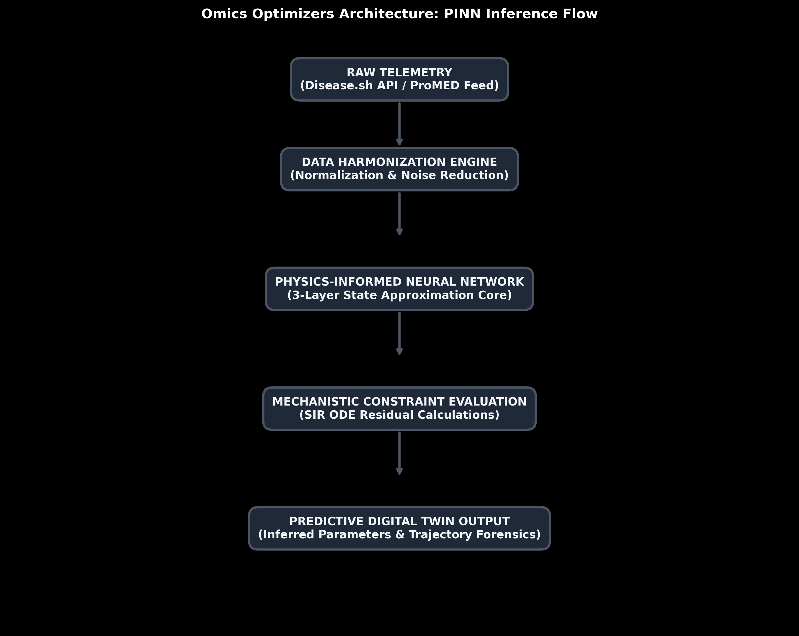
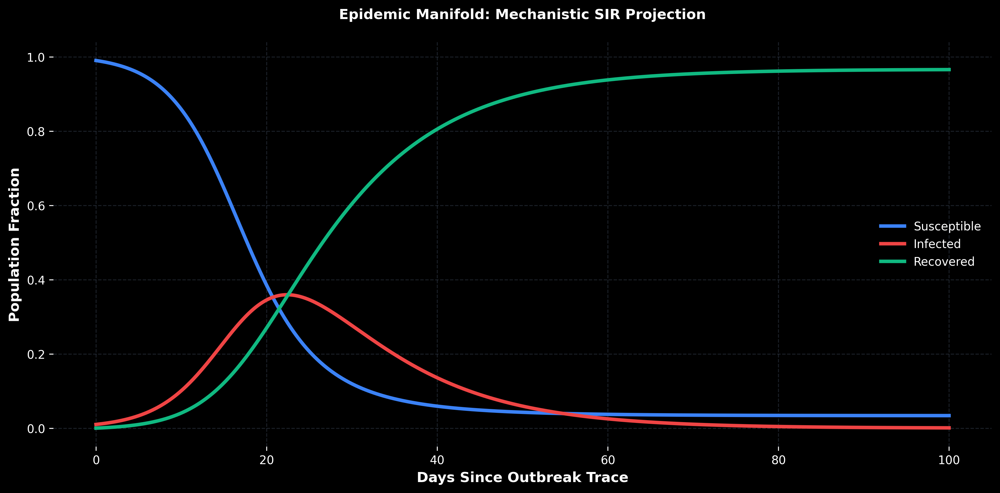

# Omics Optimizers: Epidemiological Digital Twin

A mechanical inference system for disease surveillance and forecasting. Developed for the 2026 March 18 submission.

## Overview

Traditional public health monitoring often relies on reactive data aggregation. Omics Optimizers introduces a predictive modeling framework that utilizes Physics-Informed Neural Networks (PINNs). This system identifies the underlying parameters of an outbreak from fragmented global telemetry, transforming static reports into a mathematically verified trajectory projection.

## System Architecture



### 1. Data Harmonization

The system aggregates heterogeneous telemetry from structured public health modules and unstructured reports. This process normalizes data signals into a unified format for model input.

### 2. Mechanistic Inference Engine

The backend performs parameter identification using a PINN architecture. The model is constrained by the SIR (Susceptible-Infected-Recovered) differential equations via a composite loss function, ensuring that the learned projections remain physically consistent.



## Feature Set

- **High-Fidelity Modeling**: Automated parameter identification (Beta, Gamma, R0) directly from live data.
- **Unified Telemetry**: Joint processing of official statistics (Disease.sh) and clinical reports (ProMED-mail).
- **Interactive Visualization**: A Streamlit-based interface for real-time model interaction and monitoring.

## Technical Configuration

### Prerequisites

- Python 3.10+
- NVIDIA CUDA (Optional, for hardware acceleration)

### Initialization

```powershell
# Install system dependencies
pip install -r backend/requirements.txt

# Start the inference backend
cd backend
python main.py

# Launch the visual dashboard (in a separate terminal)
streamlit run frontend/app.py
```

## Contributing and Future Scope

Future iterations of the platform aim to incorporate geographic spatial modeling via Graph Neural Networks and multi-variant competition simulations for more refined forecasting.

---

**Omics Optimizers**
March 18, 2026
